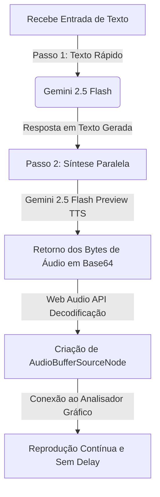

# Sistema de Fala Consistente e Fluida da IA (Voz Nativa Gemini)

Este documento descreve como o sistema de **reprodução de voz da Inteligência Artificial** foi projetado para garantir consistência de áudio, alta velocidade de resposta, duração adequada da fala e fluidez absoluta sem cortes abruptos.

---

## ⚡ Fluxo de Geração e Reprodução da IA

Para obter a máxima velocidade de resposta mantendo a fidelidade emocional e qualidade da voz nativa do Gemini, o pipeline de resposta da IA é executado na seguinte ordem:



---

## 1. Otimização do Tempo de Resposta (Pipeline em 2 Etapas)

Em vez de usar conexões de streaming contínuo por WebSocket (que causam cortes na fala se a rede oscilar), a IA opera de forma atômica e estruturada:

1. **Geração de Texto em Milissegundos (`gemini-2.5-flash`)**: A IA primeiro gera o texto da resposta. Isso é extremamente rápido, pois modelos de linguagem para texto respondem quase instantaneamente. A legenda é exibida na tela de imediato, dando feedback visual sem qualquer atraso.
2. **Síntese Direta de Voz (`gemini-2.5-flash-preview-tts`)**: A resposta em texto curta é imediatamente enviada para o sintetizador de voz nativo do Gemini, requisitando a modalidade `['AUDIO']` com a voz correspondente do perfil (ex: Puck, Kore). A API envia o bloco de áudio completo.

---

## 2. Consistência e Fluidez do Áudio (Web Audio API)

Para evitar as "bufadas", distorções de grave ou cortes abruptos no meio da frase típicos de sistemas que tocam áudio picotado (streaming de chunks PCM soltos), a reprodução utiliza a **Web Audio API**:

* **Pacote Completo**: O arquivo de áudio recebido (`audio/wav`) é decodificado por inteiro de uma só vez pelo navegador usando `decodeAudioData`.
* **Reprodução Estável**: O navegador cria um `AudioBufferSourceNode` dedicado para cada fala. O motor de áudio do sistema operacional renderiza o áudio diretamente do buffer de memória do navegador.
* **Sem Gargalos de Rede no Meio da Fala**: Como a frase inteira já está carregada na memória do navegador antes de começar a tocar, oscilações na conexão de internet do usuário **não afetam** o áudio em reprodução. A fala da IA flui perfeitamente do início ao fim sem qualquer engasgo ou corte abrupto.

---

## 3. Controle da Duração e Turnos de Fala

* **Garantia de Finalização**: O sistema escuta o evento `'ended'` do canal de áudio (`source.addEventListener('ended')`). Isso garante que a IA fale até a última sílaba de sua resposta antes de abrir a possibilidade para uma nova iteração.
* **Prevenção de Sobreposição de Voz**: Enquanto a IA estiver reproduzindo o buffer de voz (`isSpeakingRef.current === true`), qualquer gatilho ou reinicialização de gravação externa é bloqueado, protegendo a integridade da reprodução da voz.

---

## 💻 Código de Implementação da Reprodução da IA

### Geração da Resposta (Texto + Voz)
Implementado no método `getAIResponse` em [CallScreen.tsx](file:///c:/Users/Millerium/Downloads/chamaamor-main/chamaamor-main/components/CallScreen.tsx):

```typescript
// ETAPA 1: Gerar a resposta lógica inteligente com Gemini 2.5 Flash
const textResponse = await ai.models.generateContent({
  model: 'gemini-2.5-flash',
  contents: currentHistory.map(h => ({
    role: h.role,
    parts: h.parts
  })),
  config: {
    systemInstruction: systemInstructionRef.current,
  }
});

const aiText = textResponse.candidates?.[0]?.content?.parts?.[0]?.text || "";

// ETAPA 2: Sintetizar a resposta em voz nativa de alta fidelidade
const ttsResponse = await ai.models.generateContent({
  model: 'gemini-2.5-flash-preview-tts',
  contents: [{ role: 'user', parts: [{ text: aiText }] }],
  config: {
    responseModalities: ['AUDIO'],
    speechConfig: {
      voiceConfig: { prebuiltVoiceConfig: { voiceName: profile.voice } }
    }
  }
});

const ttsAllParts = ttsResponse.candidates?.[0]?.content?.parts || [];
const audioPart = ttsAllParts.find((p: any) => p.inlineData?.data);
const aiAudioBase64 = audioPart?.inlineData?.data;
const aiAudioMimeType = audioPart?.inlineData?.mimeType || "audio/wav";
```

### Decodificação e Reprodução Fluida
Implementado no método `playResponseAudio` em [CallScreen.tsx](file:///c:/Users/Millerium/Downloads/chamaamor-main/chamaamor-main/components/CallScreen.tsx):

```typescript
const playResponseAudio = async (base64Audio: string, mimeType: string) => {
  if (!outputAudioContextRef.current) return;
  
  if (outputAudioContextRef.current.state === 'suspended') {
    await outputAudioContextRef.current.resume();
  }
  
  try {
    // 1. Converter string Base64 recebida em Array de Bytes binários
    const rawBinary = window.atob(base64Audio);
    const bytes = new Uint8Array(rawBinary.length);
    for (let i = 0; i < rawBinary.length; i++) {
      bytes[i] = rawBinary.charCodeAt(i);
    }
    
    // 2. Decodificar os bytes em um AudioBuffer na memória local
    let audioBuffer: AudioBuffer;
    if (mimeType.includes('wav')) {
      audioBuffer = await decodeAudioData(bytes, outputAudioContextRef.current, 24000, 1);
    } else {
      audioBuffer = await outputAudioContextRef.current.decodeAudioData(
        bytes.buffer.slice(bytes.byteOffset, bytes.byteOffset + bytes.byteLength)
      );
    }
    
    // 3. Criar a fonte de áudio nativa do navegador
    const source = outputAudioContextRef.current.createBufferSource();
    source.buffer = audioBuffer;
    
    // Conectar ao analisador de frequência (usado para animar as ondas visuais da IA)
    if (aiAnalyserRef.current) {
      source.connect(aiAnalyserRef.current);
      if (outputGainNodeRef.current) {
        aiAnalyserRef.current.connect(outputGainNodeRef.current);
      }
    } else {
      source.connect(outputGainNodeRef.current || outputAudioContextRef.current.destination);
    }
    
    // Garantir que a IA fale a frase completa até o final antes de liberar novas ações
    source.addEventListener('ended', () => {
      sourcesRef.current.delete(source);
      setIsSpeaking(false);
      isSpeakingRef.current = false;
      startSpeechRecognition(); // Escuta reativada somente após o fim do áudio
    });
    
    sourcesRef.current.add(source);
    setIsSpeaking(true);
    isSpeakingRef.current = true;
    source.start(0); // Toca o buffer imediatamente
  } catch (e) {
    console.error("Error playing response audio:", e);
    setIsSpeaking(false);
    isSpeakingRef.current = false;
    startSpeechRecognition();
  }
};
```
