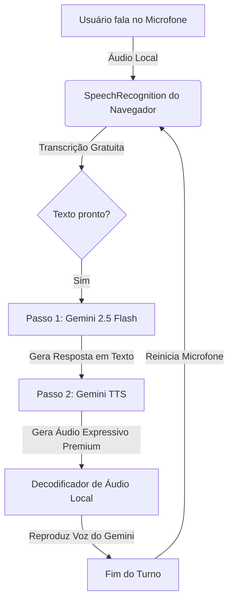

# Fluxo de Conversação por Turnos e Voz Dinâmica (STT + Gemini TTS)

Este documento registra a arquitetura de conversação por voz da chamada de vídeo, explicando como o sistema funciona de maneira rápida, consistente e econômica, acompanhado do código de implementação real.

---

## 🛠️ Arquitetura do Sistema de Voz

A chamada de vídeo utiliza uma abordagem híbrida de **duas etapas**: processamento local de entrada no cliente (navegador) e síntese generativa premium na nuvem (Gemini).



---

## 💻 Implementação do Código

### 1. Inicialização do Reconhecimento de Fala (STT Local)
Configurado dentro da função `startCall` no arquivo [CallScreen.tsx](file:///c:/Users/Millerium/Downloads/chamaamor-main/chamaamor-main/components/CallScreen.tsx). O reconhecimento detecta o idioma configurado no perfil e reinicia de forma segura com um delay para evitar loops infinitos.

```typescript
// Configuração do Speech Recognition no navegador do usuário
const SpeechRecognition = (window as any).SpeechRecognition || (window as any).webkitSpeechRecognition;
if (SpeechRecognition) {
  const rec = new SpeechRecognition();
  rec.continuous = false;
  rec.interimResults = false;
  
  // Mapeamento dinâmico para os códigos de idioma BCP-47
  const langMap: Record<string, string> = {
    'Português': 'pt-BR',
    'English': 'en-US',
    'Español': 'es-ES',
    'Français': 'fr-FR',
    'Italiano': 'it-IT',
    'Deutsch': 'de-DE',
    '日本語': 'ja-JP',
    '中文': 'zh-CN',
    '한국어': 'ko-KR',
    'العربية': 'ar-SA'
  };
  rec.lang = langMap[profile.language] || 'pt-BR';

  rec.onstart = () => {
    console.log("Speech recognition started");
  };

  rec.onresult = (event: any) => {
    const text = event.results[0][0].transcript;
    if (text && text.trim().length > 0) {
      handleUserSpeech(text); // Dispara envio para IA
    }
  };

  rec.onerror = (event: any) => {
    // Silencia o erro no-speech (silêncio normal do usuário) para evitar logs desnecessários
    if (event.error === 'no-speech') return;
    console.error("Speech recognition error:", event.error);
  };

  rec.onend = () => {
    // Reinicia após um curto delay para não sobrecarregar o processador do navegador
    if (isConnectedRef.current && !isSpeakingRef.current) {
      setTimeout(() => {
        if (isConnectedRef.current && !isSpeakingRef.current) {
          try { rec.start(); } catch (e) {}
        }
      }, 300);
    }
  };

  recognitionRef.current = rec;
}
```

---

### 2. Processamento da Resposta da IA (Texto ➡️ Áudio Gemini TTS)
Ao concluir a transcrição da fala do usuário, o sistema executa o fluxo de geração em 2 etapas para extrair o texto inteligente e sintetizar a voz nativa do Gemini.

```typescript
const getAIResponse = async (currentHistory: typeof historyRef.current) => {
  if (!apiKey) return;
  
  try {
    setIsSpeaking(true);
    isSpeakingRef.current = true;
    stopSpeechRecognition(); // Muta o microfone temporariamente para IA não se escutar

    const ai = new GoogleGenAI({ apiKey });

    // ETAPA 1: Gerar a resposta lógica inteligente com Gemini 2.5 Flash
    const textResponse = await ai.models.generateContent({
      model: 'gemini-2.5-flash',
      contents: currentHistory.map(h => ({
        role: h.role,
        parts: h.parts
      })),
      config: {
        systemInstruction: systemInstructionRef.current,
      }
    });

    const aiText = textResponse.candidates?.[0]?.content?.parts?.[0]?.text || "";

    if (!aiText) {
      setIsSpeaking(false);
      isSpeakingRef.current = false;
      startSpeechRecognition();
      return;
    }

    // Exibe a legenda traduzida instantaneamente na tela
    showCaption(aiText);

    // Salva a mensagem no histórico do banco de dados (Supabase)
    if (conversationIdRef.current) {
      supabase.from('messages').insert({
        conversation_id: conversationIdRef.current,
        sender: 'ai',
        content: aiText
      }).then();
    }

    const nextHistory = [
      ...currentHistory,
      { role: 'model' as const, parts: [{ text: aiText }] }
    ];
    setHistory(nextHistory);
    historyRef.current = nextHistory;

    // ETAPA 2: Sintetizar a resposta em voz nativa com o Gemini TTS
    const ttsResponse = await ai.models.generateContent({
      model: 'gemini-2.5-flash-preview-tts',
      contents: [{ role: 'user', parts: [{ text: aiText }] }],
      config: {
        responseModalities: ['AUDIO'],
        speechConfig: {
          voiceConfig: { prebuiltVoiceConfig: { voiceName: profile.voice } }
        }
      }
    });

    const ttsAllParts = ttsResponse.candidates?.[0]?.content?.parts || [];
    const audioPart = ttsAllParts.find((p: any) => p.inlineData?.data);
    const aiAudioBase64 = audioPart?.inlineData?.data;
    const aiAudioMimeType = audioPart?.inlineData?.mimeType || "audio/wav";

    if (aiAudioBase64) {
      // Reproduz o áudio recebido
      await playResponseAudio(aiAudioBase64, aiAudioMimeType);
    } else {
      setIsSpeaking(false);
      isSpeakingRef.current = false;
      startSpeechRecognition(); // Reativa escuta se falhar
    }

  } catch (err) {
    console.error("Error getting AI voice response:", err);
    setIsSpeaking(false);
    isSpeakingRef.current = false;
    startSpeechRecognition();
  }
};
```

---

### 3. Decodificação e Reprodução de Áudio com Controle de Visualizador
Os bytes Base64 recebidos são decodificados localmente para alimentar a caixa de som e o visualizador gráfico de ondas.

```typescript
const playResponseAudio = async (base64Audio: string, mimeType: string) => {
  if (!outputAudioContextRef.current) return;
  
  if (outputAudioContextRef.current.state === 'suspended') {
    await outputAudioContextRef.current.resume();
  }
  
  try {
    const rawBinary = window.atob(base64Audio);
    const bytes = new Uint8Array(rawBinary.length);
    for (let i = 0; i < rawBinary.length; i++) {
      bytes[i] = rawBinary.charCodeAt(i);
    }
    
    let audioBuffer: AudioBuffer;
    if (mimeType.includes('wav')) {
      audioBuffer = await decodeAudioData(bytes, outputAudioContextRef.current, 24000, 1);
    } else {
      audioBuffer = await outputAudioContextRef.current.decodeAudioData(
        bytes.buffer.slice(bytes.byteOffset, bytes.byteOffset + bytes.byteLength)
      );
    }
    
    const source = outputAudioContextRef.current.createBufferSource();
    source.buffer = audioBuffer;
    
    // Conecta ao analisador para mover as ondas visuais da IA na tela
    if (aiAnalyserRef.current) {
      source.connect(aiAnalyserRef.current);
      if (outputGainNodeRef.current) {
        aiAnalyserRef.current.connect(outputGainNodeRef.current);
      }
    } else {
      source.connect(outputGainNodeRef.current || outputAudioContextRef.current.destination);
    }
    
    // Quando a fala da IA termina, o microfone é liberado para o usuário falar
    source.addEventListener('ended', () => {
      sourcesRef.current.delete(source);
      setIsSpeaking(false);
      isSpeakingRef.current = false;
      startSpeechRecognition(); // Usuário agora pode falar
    });
    
    sourcesRef.current.add(source);
    setIsSpeaking(true);
    isSpeakingRef.current = true;
    source.start(0);
  } catch (e) {
    console.error("Error playing response audio:", e);
    setIsSpeaking(false);
    isSpeakingRef.current = false;
    startSpeechRecognition();
  }
};
```
