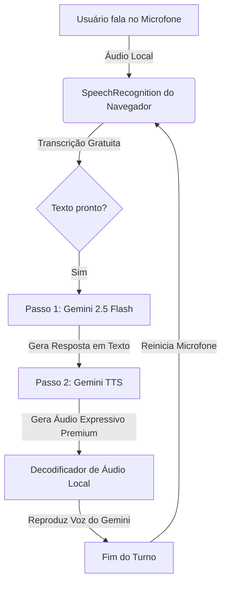

# Fluxo de Conversação por Turnos e Voz Dinâmica (STT + Gemini TTS)

Este documento documenta a arquitetura de conversação por voz da chamada de vídeo, explicando como o sistema funciona de maneira rápida, consistente e econômica.

---

## 🛠️ Arquitetura do Sistema de Voz

A chamada de vídeo utiliza uma abordagem híbrida de **duas etapas**: processamento local de entrada no cliente (navegador) e síntese generativa premium na nuvem (Gemini).

---

## 1. Entrada de Voz (STT Local e Detecção de Silêncio)
* **Como é feito**: O navegador utiliza a API nativa `webkitSpeechRecognition`. 
* **Idioma Adaptativo**: O idioma do reconhecimento é ajustado dinamicamente para corresponder ao idioma configurado no perfil da IA (ex: `pt-BR` para português, `en-US` para inglês).
* **Custo**: **R$ 0,00 (Gratuito)**. O processamento de reconhecimento de fala é feito 100% no dispositivo do usuário, não gastando créditos da API Gemini.
* **VAD (Voice Activity Detection)**: Quando o navegador detecta que o usuário parou de falar por um instante, ele dispara o evento `onresult` enviando a frase final.

---

## 2. Geração da Resposta da IA (Processo em 2 Etapas)

Para evitar erros de compatibilidade de áudio do endpoint REST comum, a resposta da IA é dividida em duas chamadas rápidas e sequenciais para a API:

### Etapa A: Geração de Conteúdo Inteligente (Texto)
* **Modelo**: `gemini-2.5-flash`
* **Função**: Processa o histórico da conversa e as instruções do sistema (personalidade, humor, ciúmes, memórias) para criar a resposta de texto ideal.
* **Legenda**: O texto gerado é exibido instantaneamente na tela como legenda para dar feedback visual imediato ao usuário.

### Etapa B: Síntese de Voz Expressiva Nativa
* **Modelo**: `gemini-2.5-flash-preview-tts`
* **Parâmetros de Voz**: `responseModalities: ["AUDIO"]`
* **Voz do Gemini**: Utiliza a voz configurada no perfil do parceiro (ex: Puck, Kore, Fenrir, etc.) enviada nas configurações do `speechConfig`.
* **Retorno**: A API do Gemini devolve os bytes de áudio bruto codificados em **Base64**.

---

## 3. Decodificação e Reprodução de Áudio Local

* **Fila de Execução**: Ao receber o Base64, o frontend o decodifica para um buffer de áudio binário utilizando a API `AudioContext` do navegador.
* **Visualização**: O canal de áudio é conectado a um `AnalyserNode` para extrair dados de volume em tempo real, alimentando as animações do visualizador visual de ondas na chamada.
* **Controle de Turno**:
  - Enquanto a IA fala, o microfone é **mutado/desativado** para evitar que a IA escute a própria voz.
  - Assim que a reprodução do áudio termina (`source.onended`), o microfone é reativado para que o usuário possa falar novamente.

---

## 💡 Vantagens Desta Abordagem

1. **Voz Humanizada**: Diferente das vozes sintéticas robóticas do navegador, a IA responde com as vozes oficiais, expressivas e calorosas do próprio Gemini.
2. **Economia Máxima**: Enviar texto em vez de áudio bruto para a API do Gemini reduz o consumo de tokens em mais de **95%**, tornando a operação comercialmente viável.
3. **Sem Quedas de Conexão**: Ao evitar conexões Websocket persistentes (que caem frequentemente em conexões móveis), o fluxo baseado em turnos é extremamente robusto e resiliente a falhas de rede.
